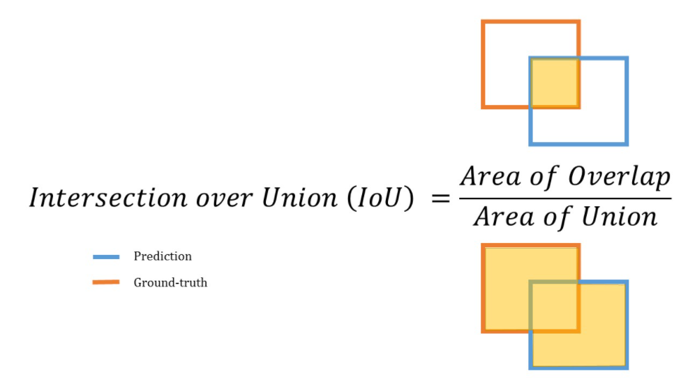
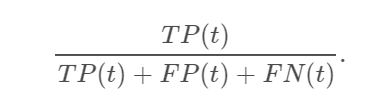
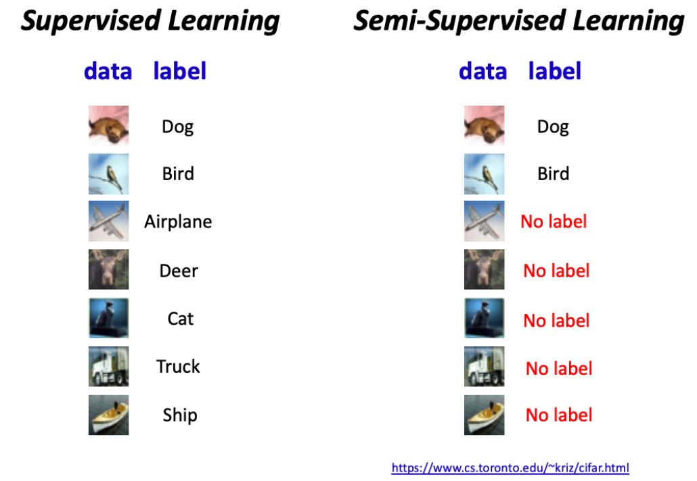
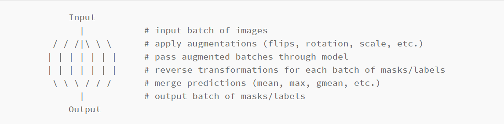

# DeepLearning Project
**This work is the solution of the second winner of a kaggle competition that we have included here as part of a student project whose participants are:**
* Christelle AMOUGOU
* Thanuja RATNASINGAM
* Mounif Alade SANNI
* Flaude BANZA

# Global Wheat Detection

## Description
Most food products are made from wheat. Thanks to its popularity in use, wheat is widely studied in the agricultural field. Specialists are working on detecting an image of wheat ears collected from many wheat fields around the world. Described as spikes at the top of the plant containing the grain, the images of wheat ears are processed to estimate its size and density in different varieties. Farmers will be able to use the data to assess health and maturity when making management decisions in their fields.
However, accurately detecting wheat ears in outdoor field images can be visually difficult. There are often overlaps of dense wheat plants and weather such as wind can blur the photographs. Both make it difficult to identify unique heads. Additionally, appearances vary due to maturity, color, genotype, and head orientation. Finally, as wheat is cultivated all over the world, different varieties, planting densities, patterns and field conditions must be considered. The models developed for the phenotyping of wheat must be generalized between different growing environments. Current detection methods involve one and two stage detectors (Yolo-V3 and Faster-RCNN), but even when trained with a large dataset, a bias towards the training region remains.
With improved detection, farmers can better assess their crops.
So, the goal of this Kaggle competition is to detect wheat ears from outdoor images of wheat plants from around the world. Using global data, a generalized solution will have to be found to estimate the number and size of wheat ears. To better assess the performance of genotypes, environments, and invisible viewing conditions, the training dataset covers multiple regions.
**Predictions**\
Contributors are attempting to predict bounding boxes around each wheat head in the pictures that contain them. If there are no ears of wheat, you must predict no bounding boxes.

## Data
**Files**
* train.csv - the training data
* sample_submission.csv - a sample submission file in the correct format
* train.zip - training images
* test.zip - test images

**Columns**
* image_id - the unique image ID
* width, height - the width and height of the images
* bbox - a bounding box, formatted as a Python-style list of [xmin, ymin, width, height]
* etc.
The Global Wheat Head dataset is led by nine research institutes from seven countries: The University of Tokyo, the National Research Institute for Agriculture, Food and the Environment, Arvalis, ETHZ, the University of Saskatchewan, University of Queensland, Nanjing Agricultural University and Rothamsted Research. These institutions are joined by many in their quest to accurately detect wheat ears, including the World Food Security Institute, DigitAg, Kubota and Hiphen. Approximately 3000 images from Europe (France, United Kingdom, Switzerland) and North America (Canada) are used and the test data includes approximately 1000 images from Australia, Japan, and China.
The data are images of wheat fields, with bounding boxes for each ear of wheat identified. All images do not include the ears of wheat. The images were recorded in many places around the world. 
CSV data is simple - image ID and image width and height are included. There is a line in train.csv for each bounding box. Not all images have bounding boxes. 
Most of the images in the test set are hidden. A small subset of test images has been included for writing code.
More details on the data acquisition and processes are available at https://arxiv.org/abs/2005.02162

## Metrics
This algorithm is evaluated on the mean average precision at different intersection over union (IoU) thresholds. The IoU of a set of predicted bounding boxes and ground truth bounding boxes is calculated as:
Intersection over Union is a measure of the magnitude of overlap between two bounding boxes (or, in the more general case, two objects). It calculates the size of the overlap between two objects, divided by the total area of the two objects combined.

It can be visualized as the following:

**Intersection over Union (IoU)**\
Intersection over Union is a measure of the magnitude of overlap between two bounding boxes (or, in the more general case, two objects). It calculates the size of the overlap between two objects, divided by the total area of the two objects combined.
It can be visualized as the following:

The two boxes in the visualization overlap, but the area of the overlap is insubstantial compared with the area taken up by both objects together. IoU would be low - and would likely not count as a "hit" at higher IoU thresholds.

The two boxes in the visualization overlap, but the area of the overlap is insubstantial compared with the area taken up by both objects together. IoU would be low - and would likely not count as a "hit" at higher IoU thresholds.
The metric sweeps over a range of IoU thresholds, at each point calculating an average precision value. The threshold values range from 0.5 to 0.75 with a step size of 0.05. In other words, at a threshold of 0.5, a predicted object is considered a "hit" if its intersection over union with a ground truth object is greater than 0.5.

At each threshold value t, a precision value is calculated based on the number of true positives (TP), false negatives (FN), and false positives (FP) resulting from comparing the predicted object to all ground truth objects:

A true positive is counted when a single predicted object matches a ground truth object with an IoU above the threshold. A false positive indicates a predicted object had no associated ground truth object. A false negative indicates a ground truth object had no associated predicted object. If there are no ground truth objects at all for a given image, any number of predictions (false positives) will result in the image receiving a score of zero and being included in the mean average precision.
The average precision of a single image is calculated as the mean of the above precision values at each IoU threshold:

When submitting the contest, contributors are asked to provide a confidence level for each bounding box. Bounding boxes will be evaluated in the order of their confidence levels in the process above. This means that bounding boxes with higher confidence will be checked first for matches with solutions, which determines which boxes are considered true and false positives.
Finally, the score returned by the competition metric is the average taken over the individual average accuracies of each image in the test dataset.

## Concepts

* **MixUp**\
MixUp is a recently proposed method for training deep neural networks(DNN)
where additional samples are generated during training by convexly combining
random pairs of images and their associated labels. While simple to implement,
it has been shown to be a surprisingly effective method of data augmentation
for image classification: DNNs trained with mixup show noticeable gains in
classification performance on a number of image classification benchmarks.
Mixup training is based on the principle of Vicinal Risk Minimization (VRM): the classifier
is trained not only on the training data, but also in the vicinity of each training sample. 
MixUp can be represented with this simple equation:

<b>newImage = alpha * image1 + (1-alpha) * image2</b>

This newImage is simply a blend of 2 images from your training set, it is that simple! So, what will be the target value for the newImage?

<b>newTarget = alpha * target1 + (1-alpha) * target2</b>

The important thing here, is that you don’t always need to One Hot Encode your target vector. In case you are not doing OneHotEncoding, custom loss function will be required.

* **FixMatch**\
FixMatch is a semi-supervised learning method that use consistency regularization as cross-entropy between one-hot pseudo-labels of weakly translation applied images and prediction of strongly translated them. It is possible to learn with even a very small amount of labeled data.\
Semi-supervised learning (SSL) is a learning method where learning is performed with a small number of labeled data and a large number of unlabeled data.The biggest advantage against supervised learning is that you do not need to prepare labels for all data.

 
For more understanding about FixMatch see : https://amitness.com/2020/03/fixmatch-semi-supervised/   
https://medium.com/analytics-vidhya/fixmatch-semi-supervised-learning-method-that-can-be-learned-even-if-there-is-only-one-labeled-e7e1b37e8935

* **TTA**
Similar to what Data Augmentation is doing to the training set, the purpose of Test Time Augmentation(TTA) is to perform random modifications to the test images. Thus, instead of showing the regular, “clean” images, only once to the trained model, we will show it the augmented images several times. We will then average the predictions of each corresponding image and take that as our final guess.

